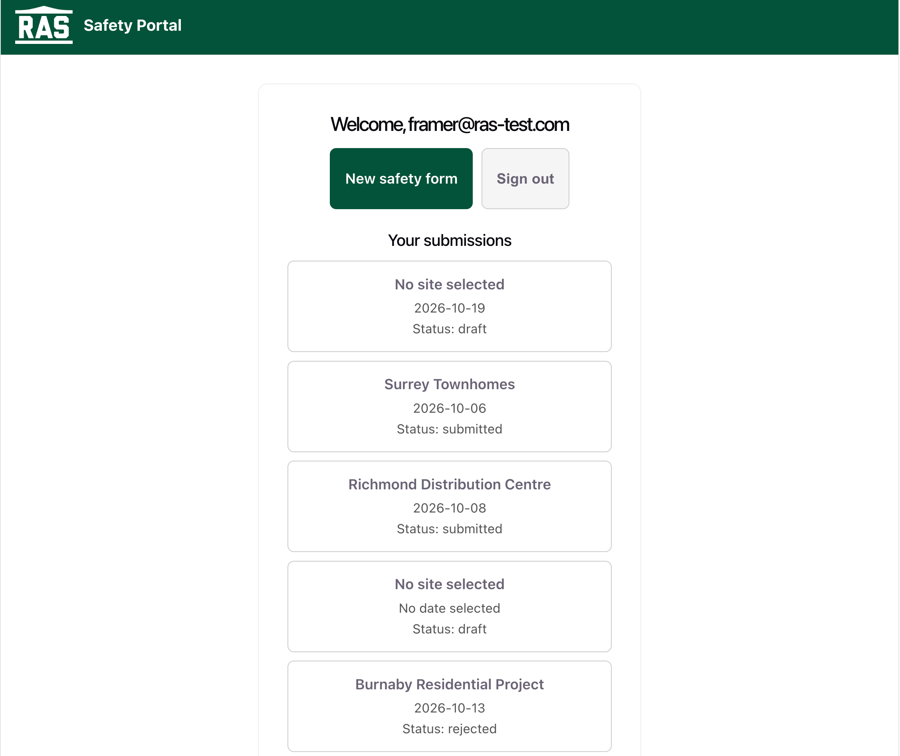
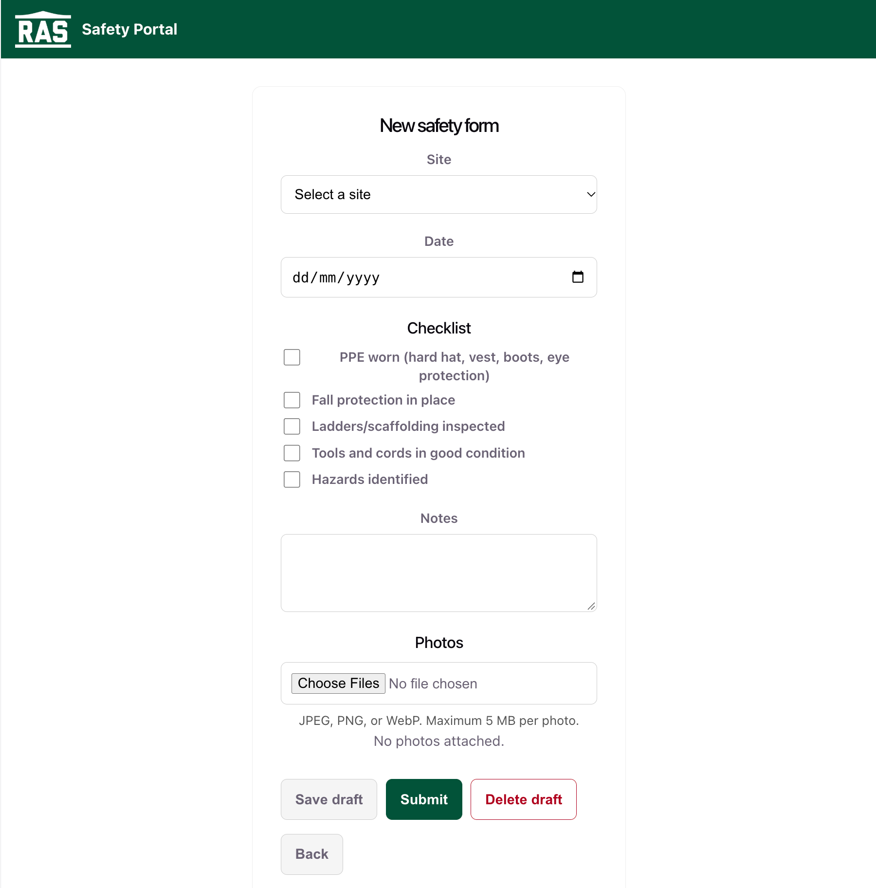
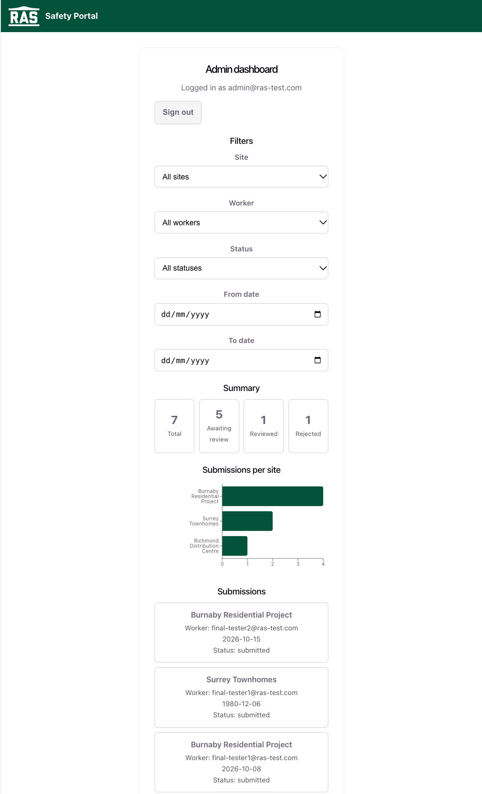
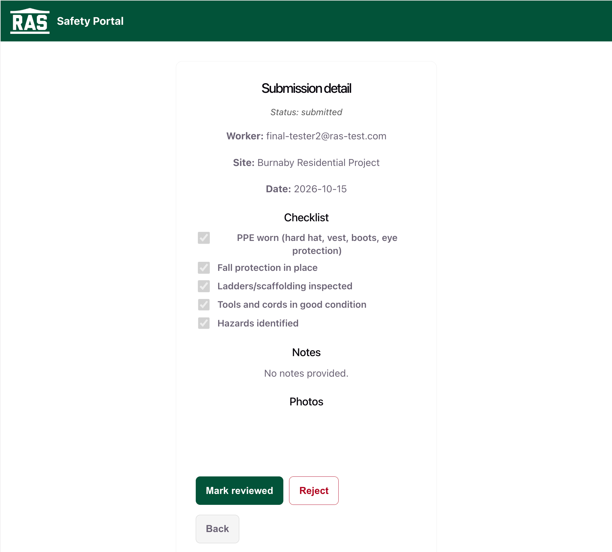
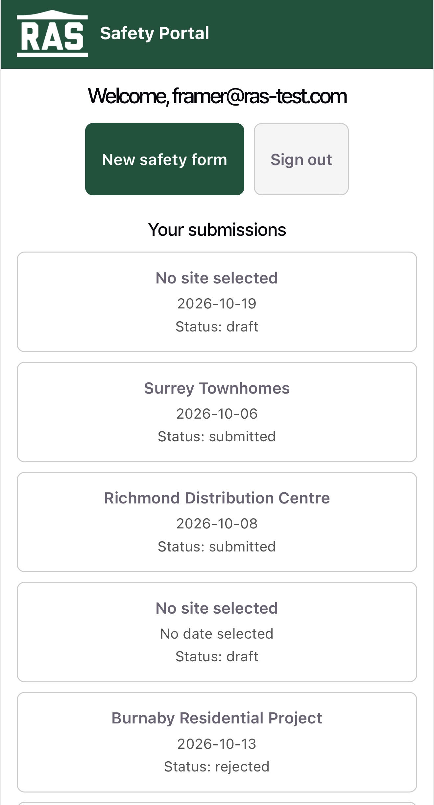
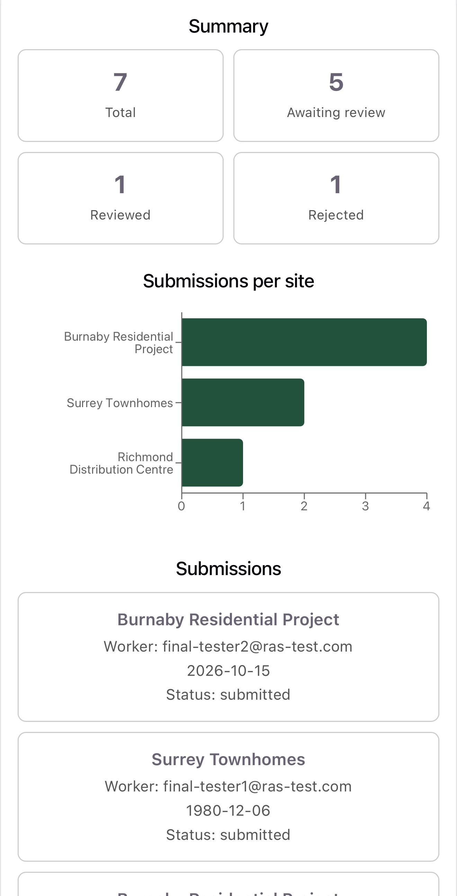
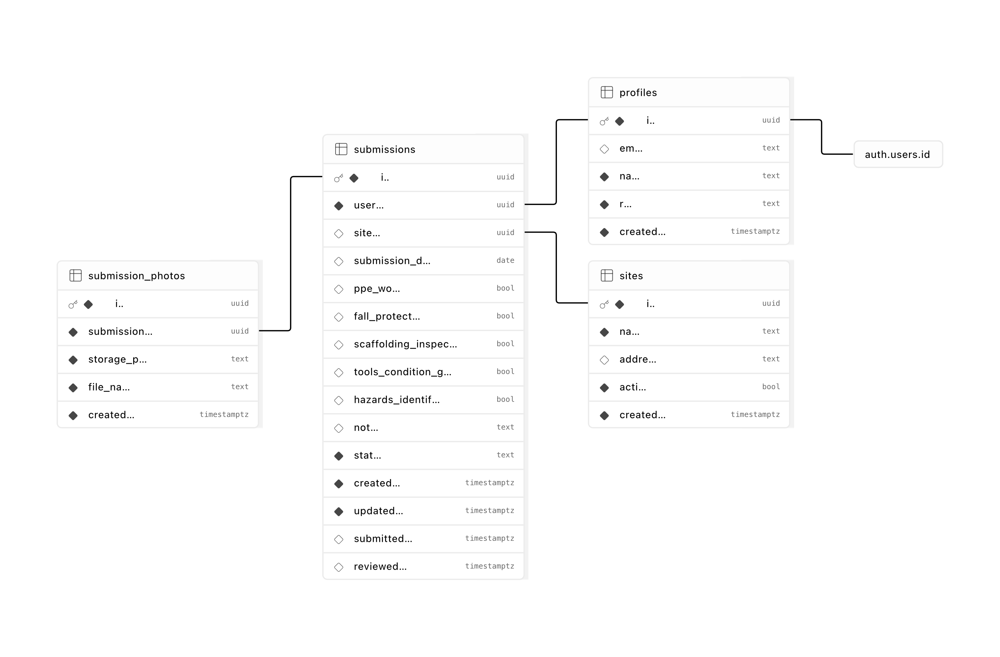

# RAS Safety Portal

A safety-compliance web application built as a technical assessment for Ron Anderson & Sons (RAS).

Framers complete daily site safety checklists with photo evidence, while administrators review submissions across all sites, filter by worker/site/date/status, and monitor activity through summary cards and a submissions-per-site chart.

**Deployed app:** https://ron-anderson-sons.vercel.app  
**Repository:** https://github.com/haoniu08/RonAndersonSons

> This project emulates an internal RAS tool as part of a technical
> assessment. No data submitted here is used by RAS. All demo sites,
> users, and submissions are fictional.

---

## 1. Project Overview

RAS crews work across multiple construction sites. Framers complete daily site safety forms containing a checklist, notes, and photo evidence.

Supervisors need a central place to review completed forms, identify who submitted them, see which site they belong to, inspect supporting photos, and track submission status.

### Framer workflow

1. Log in
2. Select a site and date
3. Complete the safety checklist
4. Add optional notes
5. Upload one or more photos
6. Save the form as a draft or submit it
7. View the submission and its current status from the personal dashboard

Drafts remain editable until submission. Once submitted, the form becomes read-only for the framer.

### Admin workflow

1. Log in
2. View submitted, reviewed, and rejected safety forms
3. Filter by:
   - Site
   - Worker
   - Status
   - Date range
4. Open a submission to review:
   - Worker
   - Site
   - Date
   - Checklist
   - Notes
   - Photos
5. Mark the submission as reviewed or rejected
6. Monitor submission activity through summary cards and a submissions-per-site chart

---

## 2. Tech Stack

- **Frontend:** React + TypeScript
- **Build tool:** Vite
- **Routing:** React Router
- **Backend / database:** Supabase
  - PostgreSQL
  - Authentication
  - Storage
  - Row Level Security
- **Hosting:** Vercel
- **Charting:** Recharts
- **Version control:** Git + GitHub

---

## 3. Features

### Authentication and roles

- Email/password authentication through Supabase Auth
- Two application roles:
  - **Framer**
  - **Admin**
- Newly created users default to the `framer` role
- Admin promotion is handled separately rather than being client-controlled

### Framer features

- Personal dashboard containing only the logged-in user's submissions
- Create new safety forms
- Select construction site and date
- Safety checklist covering:
  - PPE
  - Fall protection
  - Ladders / scaffolding
  - Tools and cords
  - Hazard identification
- Free-text notes
- Save incomplete forms as drafts
- Reopen and edit drafts
- Delete drafts
- Multi-photo upload
- Supported image types:
  - JPEG
  - PNG
  - WebP
- Maximum file size: **5 MB per photo**
- Photo preview and removal while still in draft
- Validation before final submission
- Clear success and error feedback
- Read-only form after submission

### Admin features

- View all non-draft submissions
- Submission list includes:
  - Worker
  - Site
  - Date
  - Status
- Filter by:
  - Site
  - Worker
  - Status
  - Date range
- Filters are applied through Supabase/PostgreSQL queries rather than only client-side filtering
- View full submission details
- View full-resolution submission photos
- Mark submitted forms as:
  - Reviewed
  - Rejected
- Summary cards for:
  - Total submissions
  - Awaiting review
  - Reviewed
  - Rejected
- Submissions-per-site bar chart
- Summary values and chart update based on active filters

### UI / UX

- RAS logo and brand green (`#045339`)
- Responsive layout
- Mobile-focused worker workflow
- Touch-friendly controls
- Tested at common mobile widths and on physical phone hardware
- SPA routing configured for direct URL access and page refreshes

---

## 4. Screenshots

### Framer Dashboard



### Safety Form



### Admin Dashboard



### Admin Submission Review



### Mobile Framer View



### Mobile Admin View



---

## 5. Architecture & Security

The React client communicates directly with Supabase.

There is no separate Express or Node API server.

Supabase provides the required backend functionality through:

- PostgreSQL
- Authentication
- Row Level Security
- Storage
- Database triggers

### Authorization model

Supabase Row Level Security is the application's actual authorization boundary.

Client-side route guards improve user experience, but they are not relied upon for security.

RLS policies enforce that:

- Framers can read their own submissions at any status
- Framers may only create, modify, delete, or attach/remove photos while their submission is still a draft
- Framers cannot access another framer's submissions
- Admins can read submissions across users, while the Admin review UI intentionally excludes drafts.
- Admin review transitions are restricted to submitted records
- Client-side users cannot promote themselves to Admin

This means that bypassing the React UI does not bypass data authorization.

### Why no separate backend?

The assessment requirements are fully covered by Supabase:

- Authentication
- Authorization
- Relational data
- File storage
- Filtering
- Database constraints
- Server-side triggers

Adding a custom Express layer would mostly duplicate authorization and CRUD logic already enforced directly at the database layer.

For this scope, Supabase provides a simpler architecture while still keeping the security boundary server-side.

### Photo storage

Photos are stored in a private Supabase Storage bucket:

```text
submission-photos
```

Object paths use the structure:

```text
{user_id}/{submission_id}/{uuid}-{filename}
```

The bucket is not public.

Photos are accessed using short-lived signed URLs generated on demand.

Storage policies on `storage.objects` enforce ownership and draft-state rules independently from the `submission_photos` database table.

---

## 6. Database & ERD



The application uses four primary application tables in addition to Supabase's built-in `auth.users`.

### `profiles`

Extends `auth.users` with application-specific user information.

Key fields:

- `id`
- `email`
- `name`
- `role`
- `created_at`

Each profile has one of two roles:

```text
framer
admin
```

A database trigger automatically creates the profile record when a new Supabase Auth user is created.

### `sites`

Stores available construction sites.

Key fields:

- `id`
- `name`
- `address`
- `active`
- `created_at`

The `active` flag allows a site to be retired without deleting historical submissions.

### `submissions`

Stores safety-form records associated with a framer, site, and date.

Key fields include:

- `id`
- `user_id`
- `site_id`
- `submission_date`
- checklist fields
- `notes`
- `status`
- `created_at`
- `updated_at`
- `submitted_at`
- `reviewed_at`

Multiple submissions for the same framer/site/date are intentionally allowed.

This supports cases where:

- site conditions change during the day
- a worker needs to create a corrected submission
- a rejected form needs to be replaced by a new submission

Checklist items are stored as explicit boolean columns rather than JSON.

This keeps them directly queryable and type-safe, for example:

```sql
where fall_protection = false
```

The tradeoff is that adding a new checklist item requires a schema migration, which is reasonable for the fixed checklist used in this assessment.

### `submission_photos`

Stores metadata for uploaded submission photos.

Key fields:

- `id`
- `submission_id`
- `storage_path`
- `file_name`
- `created_at`

The database stores the Storage object path rather than a permanent public URL.

### Relationships

```text
auth.users
    1
    |
    1
profiles
    1
    |
    *
submissions
    *
    |
    1
sites

submissions
    1
    |
    *
submission_photos
```

---

## 7. Design Decisions & Edge Cases

### Submission lifecycle

The submission lifecycle is:

```text
draft -> submitted -> reviewed
                   -> rejected
```

Drafts are editable.

Once submitted, a form becomes immutable to the framer.

Reviewed and rejected states are treated as terminal states.

If a rejected submission needs correcting, the worker creates a new submission rather than modifying the historical rejected record.

### Draft visibility

Drafts are intentionally excluded from the Admin review workflow.

A draft represents incomplete work and is not yet ready for supervisory review.

RLS currently allows admins to read drafts for future flexibility, but the Admin UI intentionally excludes them from:

- the submission list
- summary cards
- chart data

### Multiple submissions per day

There is intentionally no unique constraint on:

```text
(user_id, site_id, submission_date)
```

A worker may need to submit again if:

- conditions change later in the day
- a previous submission was rejected
- a second safety assessment is required

### Submitted forms are immutable

Once a framer submits a form, they can still view it but cannot edit or delete it.

This is enforced at both levels:

- UI fields become read-only
- RLS prevents unauthorized database updates

### Database-managed timestamps

`submitted_at`, `reviewed_at`, and `updated_at` are managed by a PostgreSQL trigger.

This keeps audit timestamps based on actual database status transitions rather than values supplied by the browser.

### Photo cleanup

Photo deletion involves both:

1. Removing the object from Supabase Storage
2. Removing the corresponding database metadata

Deleting a database row alone would not remove the physical Storage object.

The application explicitly removes Storage objects so deleted drafts do not leave orphaned files.

If a file upload succeeds but the metadata insert fails, the uploaded Storage object is also removed as cleanup.

### Admin concurrency guard

Admin review actions include a status condition:

```text
update only if status = submitted
```

If two admin sessions attempt to review the same submission at nearly the same time, only the first valid update succeeds.

The second operation updates zero rows and surfaces an explicit message rather than silently reporting success.

### Concurrent draft editing

Concurrent edits to the same draft use a last-write-wins model.

Full optimistic locking or collaborative conflict resolution was not implemented because simultaneous multi-session editing of the same worker-owned draft was outside the assessment scope.

### "Who hasn't submitted today"

This feature was considered but intentionally omitted.

The current data model does not contain:

- worker-to-site assignments
- worker schedules
- expected attendance

Without that information, the application cannot reliably determine which workers were expected to submit on a particular day.

Instead, the dashboard implements the requirement's other suggested summary:

- submissions per site
- submission status counts

---

## 8. Local Setup

### Clone the repository

```bash
git clone https://github.com/haoniu08/RonAndersonSons.git
cd RonAndersonSons
```

### Install dependencies

```bash
npm install
```

### Configure environment variables

Create a `.env` file in the project root:

```env
VITE_SUPABASE_URL=your-supabase-project-url
VITE_SUPABASE_ANON_KEY=your-supabase-anon-key
```

The Supabase anon key is intended for browser use.

Authorization is enforced through RLS.

Never expose a Supabase service-role or secret key in the frontend.

### Configure Supabase

The repository includes the SQL setup scripts under:

```text
supabase/
```

Files:

```text
supabase/
├── RLS.sql
├── photoBucketPolicies.sql
├── schema.sql
└── triggers.sql
```

Suggested setup order:

1. Run `schema.sql`
2. Run `triggers.sql`
3. Run `RLS.sql`
4. Create a private Storage bucket named:

```text
submission-photos
```

5. Run `photoBucketPolicies.sql`

At least one application user must then be manually promoted to:

```text
role = 'admin'
```

New users created through Supabase Auth automatically receive a `profiles` record with:

```text
role = 'framer'
```

### Run the application

```bash
npm run dev
```

Vite will start the local development server.

---

## 9. Assumptions, Demo Data & Tradeoffs

### Demo data

All demo data is fictional.

This includes:

- worker accounts
- construction sites
- submission records
- notes
- uploaded images used for testing

None of the demo data represents real RAS personnel, projects, or safety records.

### Test credentials

Login credentials for at least one Admin and one Framer account are provided separately in the submission email.

They are intentionally not committed to the public repository.

### Scope tradeoffs

Known scope limitations include:

- No worker-to-site assignment model
- No attendance or scheduling model
- No full optimistic locking for draft editing
- Fixed checklist schema rather than configurable checklist definitions
- No dedicated backend API layer beyond Supabase
- No email notifications or approval workflow beyond review/reject status

These were deliberate scope choices for the assessment rather than required functionality left incomplete.

---

## 10. Deployment & Testing

### Deployment

The application is deployed on Vercel:

https://ron-anderson-sons.vercel.app

The GitHub repository is connected to Vercel so pushes to the `main` branch trigger automatic redeployment.

### SPA routing

The application uses React Router.

A `vercel.json` rewrite ensures that direct navigation to nested routes such as:

```text
/admin/submissions/:id
/framer/submissions/:id
```

still serves `index.html`.

Without this rewrite, refreshing a nested client-side route would return a server-level 404 before React Router loaded.

### Manual testing

The application was tested across both roles and core workflows.

Testing included:

- Admin login
- Framer login
- Role-based redirect behavior
- Session persistence
- Logout
- Draft creation
- Draft editing
- Draft deletion
- Photo upload
- Photo validation
- Photo preview
- Photo removal
- Storage cleanup
- Final submission validation
- Draft-to-submitted transition
- Read-only submitted forms
- Admin submission detail view
- Admin review
- Admin rejection
- Concurrent admin review guard
- Site filtering
- Worker filtering
- Status filtering
- Date-range filtering
- Combined filters
- Summary-card updates
- Submissions-per-site chart updates
- Direct nested-route refresh
- Mobile layouts
- Desktop layouts
- RLS verification between different framer accounts

The responsive interface was tested at common phone widths, including approximately 375–430px, as well as on physical phone hardware.

---

## 11. Repository Structure

```text
RonAndersonSons/
├── docs/
│   └── ras-erd.png
├── public/
├── src/
├── supabase/
│   ├── RLS.sql
│   ├── photoBucketPolicies.sql
│   ├── schema.sql
│   └── triggers.sql
├── README.md
├── package.json
├── vercel.json
└── ...
```

---

## 12. Submission Links

**Live application:**  
https://ron-anderson-sons.vercel.app

**GitHub repository:**  
https://github.com/haoniu08/RonAndersonSons

Test credentials are provided separately in the submission email.